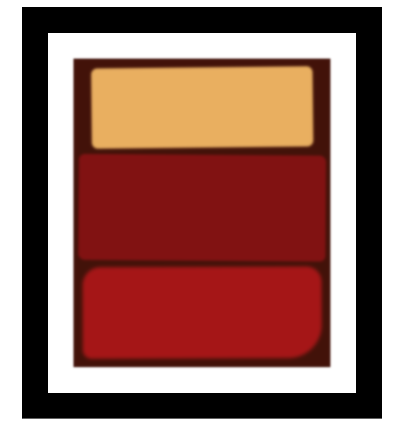

# Rothko-Inspired Painting

A simple web-based art project inspired by the works of Mark Rothko. This project uses **HTML** and **CSS** to create a vibrant, abstract painting displayed within a styled frame.

---

## Preview

The artwork features layered, blurred color blocks with subtle shadows and irregular shapes to simulate a textured painting effect.

---

## Features

- **HTML structure** for layout
- **CSS styling** for colors, shadows, and frame effects
- Minimal design with artistic inspiration
